# Checkpoint 2.0 — NSE/BSE Market Sentiment Intelligence Platform

**Team:** ROKUMATE  
**Hackathon:** HackByte  
**Date:** 2026-04-04

---

## 1. Progress Made From Last Checkpoint

### Checkpoint 1 → Checkpoint 2: Major Pivot & Feature Expansion

Since the last checkpoint, we executed a **complete strategic pivot** from a generic crypto sentiment tool to a **full-stack NSE/BSE Indian stock market intelligence platform** with a backtesting engine and multi-agent AI architecture.

#### What Changed

| Area | Checkpoint 1 | Checkpoint 2 |
|------|-------------|-------------|
| **Focus** | Crypto sentiment (BTC, ETH, etc.) | NSE/BSE Indian stocks (RELIANCE, TCS, INFY, etc.) |
| **Data Sources** | Random Twitter accounts | 15 pre-verified trusted financial news channels (CNBC-TV18, Mint, ET, BSE, NSE, etc.) with trust scores |
| **Analysis** | Basic NLP keyword matching | Multi-agent architecture — NLP agent active, pluggable slots for LLM deep analysis, external multi-agent system, and quantitative trading algorithms |
| **Core Feature** | Real-time sentiment feed | **7-day backtesting engine** — "If you had used our AI 1 week ago, you'd have gained ₹X" |
| **Pricing** | None | Real historical prices via Yahoo Finance (auto `.NS` suffix for NSE) |
| **Trade Simulation** | None | Paper trading via `MockTradeExecutor` with P&L calculation |
| **User Profiling** | None | Investor onboarding — risk tolerance (1-10), investment horizon, capital amount |
| **Strategy** | Manual config only | **AI Strategy Generator** — GPT-4o-mini creates 3 personalized strategies (Conservative/Balanced/Aggressive) |
| **Architecture** | Monolithic services | **Port/Adapter pattern** — provider-agnostic (swap Yahoo→Kite, Mock→Live broker) |
| **Frontend** | Dashboard + posts + alerts | Added 4 new pages: Profile, Backtest, AI Strategies, Agent Registry |
| **API Count** | ~28 endpoints | **35 endpoints** |

#### Key Deliverables Completed

- ✅ Investor Profile onboarding system (POST/GET `/api/profile`)
- ✅ 7-day backtesting engine with real Yahoo Finance prices (POST `/api/backtest`)
- ✅ AI strategy generator using GPT-4o-mini (POST `/api/strategies/generate`)
- ✅ Multi-agent orchestrator with universal `AgentPort` interface
- ✅ Agent registry endpoint (GET `/api/agents`)
- ✅ Trusted channel ecosystem — 15 verified Indian financial news sources with trust scores
- ✅ Channel recommender (GET `/api/channels/recommended`)
- ✅ Frontend integration of all new routes with premium UI (Fira Code font, animations, glassmorphism)
- ✅ Updated API documentation (API-Reference.md, openapi.json, openapi.yml)

---

## 2. Detailed Expected Feature Overview

### 2.1 Investor Onboarding & Profiling

Users configure their investment profile on first login:
- **Risk Tolerance** — slider from 1 (ultra conservative) to 10 (maximum risk)
- **Investment Horizon** — SHORT_TERM (< 3 months), MEDIUM_TERM (3-12 months), LONG_TERM (> 1 year)
- **Capital Amount** — how much INR they plan to invest

This profile feeds into strategy generation and backtest recommendations, personalizing all output.

### 2.2 Backtesting Engine (Core Feature)

The flagship feature. The user selects NSE stocks (e.g., RELIANCE, TCS) and the system:

1. **Scrapes** tweets from 15 trusted financial channels (filtered by `trustScore >= 0.7`)
2. **Runs all registered AI agents** via the Agent Orchestrator — currently NLP sentiment, with pluggable slots for LLM deep analysis, multi-agent system, and quantitative trading algorithms
3. **Fetches real historical OHLCV data** from Yahoo Finance for the selected stocks
4. **Matches** tweet sentiment signals to stock symbols using keyword mapping
5. **Simulates trades** — pairs BUY/SELL signals, calculates entry/exit prices from real market data
6. **Produces P&L projection**: *"If you had used our AI agent 1 week ago, you'd have gained ₹24,650 (24.65%) on RELIANCE"*

Output includes: projected gain (INR + %), win rate, total trades, individual trade signals with prices, AI recommendation text, and metadata about which agents and data providers were used.

### 2.3 AI Strategy Generator

GPT-4o-mini generates 3 personalized trading strategies based on:
- User's investor profile (risk, horizon, capital)
- Recent market sentiment data from the database
- Available AI agents and their health status

Strategies generated: **Conservative Guardian** (low risk, verified news only), **Balanced Opportunist** (moderate, all categories), **Aggressive Momentum** (high frequency, sentiment-heavy). Each includes actionable config parameters (thresholds, weights, keywords) that can be applied directly.

Falls back to a rule-based generator when OpenAI API key is not configured.

### 2.4 Multi-Agent Architecture

A universal `AgentPort` interface that any analysis engine implements:

```
AgentPort {
  name, type, version
  analyze(context) → AgentSignal[]
  isHealthy() → boolean
}
```

**Currently active:** NLP Sentiment Agent (keyword-based + social signal weighting)  
**Pluggable slots ready for:** Deep Analysis Agent (LLM), External Multi-Agent System, Trading Algorithm Agent (RSI/MACD)

The `AgentOrchestrator` registers all agents, runs healthy ones against the same context, and aggregates signals. Adding a new agent requires implementing the interface and registering it — zero changes to backtest, strategy generator, or any other consumer.

### 2.5 Trusted Channel Ecosystem

15 pre-verified Indian financial news channels seeded with trust scores:
- **High trust (0.90-0.95):** BSEIndia, NSEIndia, CNBCTV18News
- **Medium-high trust (0.80-0.88):** EconomicTimes, liveMint, BloombergQuint, NDTVProfit
- **Medium trust (0.75-0.80):** ZeeBusiness, FinancialExpress, broker channels

Trust scores weight sentiment signals during backtesting — a signal from BSE India carries more weight than a random tweet.

### 2.6 Broker-Agnostic Trade Execution

Port/Adapter pattern allows seamless provider swaps:
- **PriceDataPort** — Yahoo Finance adapter (current), Kite adapter (future)
- **TradeExecutorPort** — Mock paper trading (current), Kite live trading (future)
- **BrokerPort** — unified interface combining trade + price + portfolio

### 2.7 Real-Time Sentiment Pipeline (from Checkpoint 1)

- Twitter scraping via Nitter (every 30s via BullMQ worker)
- NLP keyword-based sentiment scoring (-1 to +1)
- LLM deep analysis via GPT-4o-mini per post
- Whale detection (high-follower accounts)
- Real-time alerts via WebSocket (Socket.IO)

---

## 3. Tech Stack

### Backend

| Layer | Technology | Purpose |
|-------|-----------|---------|
| Runtime | Node.js + TypeScript | Type-safe server |
| Framework | NestJS | Modular, DI-based API framework |
| Database | PostgreSQL | Persistent storage |
| ORM | Prisma | Type-safe database access |
| Queue | BullMQ + Redis | Background job processing |
| Auth | JWT (passport-jwt) | Stateless authentication |
| Validation | class-validator + class-transformer | DTO validation |
| Twitter | Nitter scraping (TwitterFetcherAdapter) | Tweet data ingestion |
| Prices | yahoo-finance2 v3 | Real NSE/BSE historical OHLCV |
| LLM | OpenAI GPT-4o-mini | Strategy generation + deep analysis |
| WebSocket | Socket.IO | Real-time alerts |

### Frontend

| Layer | Technology | Purpose |
|-------|-----------|---------|
| Framework | Next.js 16 (App Router) | SSR + file-based routing |
| Language | TypeScript | Type safety |
| Styling | Tailwind CSS v4 + tw-animate-css | Utility-first CSS |
| Components | shadcn/ui (Radix primitives) | Accessible UI components |
| Charts | Recharts | Data visualization |
| State | Zustand | Lightweight global state |
| HTTP | Axios | API communication |
| WebSocket | socket.io-client | Real-time updates |
| Fonts | Inter + Fira Code | Body + monospace typography |

### Infrastructure

| Layer | Technology | Purpose |
|-------|-----------|---------|
| Container | Docker Compose | Local dev environment |
| Database | PostgreSQL 15 | Data persistence |
| Cache/Queue | Redis | BullMQ job queue |

---

## 4. High-Level Architecture

### PlantUML Diagram

```plantuml
@startuml
!theme cyborg-outline
skinparam backgroundColor #0d1117
skinparam defaultFontColor #e6edf3
skinparam defaultFontName Inter
skinparam roundcorner 12
skinparam shadowing false
skinparam ArrowColor #8b949e
skinparam ComponentBorderColor #30363d
skinparam ComponentBackgroundColor #161b22
skinparam PackageBorderColor #30363d
skinparam PackageBackgroundColor #0d1117
skinparam DatabaseBorderColor #30363d
skinparam DatabaseBackgroundColor #161b22
skinparam QueueBorderColor #30363d
skinparam QueueBackgroundColor #161b22
skinparam CloudBorderColor #30363d
skinparam CloudBackgroundColor #161b22
skinparam NoteBorderColor #30363d
skinparam NoteBackgroundColor #161b22

title <b>NSE/BSE Market Sentiment Intelligence Platform</b>\n<i>High-Level Architecture</i>

actor "Investor" as user #58a6ff

package "Frontend (Next.js 16)" as fe #0d1117 {
  [Landing Page] as landing
  [Auth (Login/Signup)] as auth
  [Dashboard] as dash
  [Backtest UI] as btui
  [AI Strategy UI] as stratui
  [Agent Registry UI] as agentui
  [Profile Onboarding] as profileui
  [Posts & Alerts Feed] as feedui
}

package "Backend API (NestJS)" as be #0d1117 {

  package "Auth & User Layer" as authlayer {
    [Auth Module\nJWT signup/login] as authmod
    [User Module] as usermod
    [Profile Module\nRisk, Horizon, Capital] as profilemod
  }

  package "Data Ingestion Layer" as ingest {
    [Fetcher Module\nTwitter Scraper] as fetcher
    [Seeder Service\n10 NSE Stocks\n15 Trusted Channels] as seeder
    [Mock Post Factory\nNSE Stock Templates] as mockfactory
  }

  package "Intelligence Layer" as intel {

    package "Agent Orchestrator" as orchestrator #161b22 {
      [Agent Registry\n& Health Check] as registry
      [Signal Aggregator\nWeighted by TrustScore] as aggregator
    }

    package "Registered Agents" as agents #161b22 {
      [NLP Sentiment Agent\n(ACTIVE)\nKeyword + Impact] as nlpagent
      [Multi-Agent Workflow\n(Pluggable)] as multiagent
      [Deep Analysis Agent\nGPT-4o-mini\n(Pluggable)] as deepagent
      [Trading Algo Agent\nRSI/MACD\n(Pluggable)] as algoagent
    }

    [Strategy Generator\nGPT-4o-mini\n3 Personalized Strategies] as stratgen
  }

  package "Backtesting Engine" as btengine #161b22 {
    [Backtest Service\n7-day simulation] as btsvc

    package "Port/Adapter Layer" as ports {
      [PriceDataPort] as priceport
      [TradeExecutorPort] as tradeport
    }

    package "Adapters" as adapters {
      [Yahoo Finance\nAdapter (.NS)] as yahoo
      [Mock Trade\nExecutor (Paper)] as mockexec
      [Kite/Zerodha\nAdapter (Future)] as kite
    }

    [Trade Simulator\nP&L Calculation] as tradesim
  }

  package "Alert & Delivery Layer" as alertlayer {
    [Alert Engine\nThreshold Evaluation] as alerteng
    [WebSocket Gateway\nSocket.IO Real-time] as wsgateway
  }

  [Channels Module\nTrusted Sources\n+ Recommender] as channels
  [Posts Module\nCRUD + Feed] as posts
  [Strategies Module\nCRUD + Evaluate] as strategies
}

package "Worker Process (BullMQ)" as worker #0d1117 {
  [Fetcher Worker\nEvery 30s Poll] as fetchworker
  [Sentiment Worker\nAuto-analyze posts] as sentworker
}

database "PostgreSQL" as pg #161b22 {
  [Users & Profiles]
  [Assets & Posts]
  [Sentiments & Alerts]
  [Strategies & Channels]
}

queue "Redis" as redis #161b22 {
  [BullMQ Queues]
}

cloud "External Services" as ext #0d1117 {
  [Twitter / Nitter\nTweet Scraping] as twitter
  [Yahoo Finance API\nHistorical OHLCV] as yahooext
  [OpenAI GPT-4o-mini\nStrategy + Analysis] as openai
}

' ─── User Flows ────────────────────
user --> landing : visits
user --> auth : login/signup
user --> dash : authenticated
user --> btui : run backtest
user --> stratui : generate strategies
user --> agentui : view agents
user --> profileui : set risk/horizon/capital
user --> feedui : view posts & alerts

' ─── Frontend to Backend ──────────
fe -down-> authmod : POST /api/auth/*
fe -down-> profilemod : POST/GET /api/profile
fe -down-> btsvc : POST /api/backtest
fe -down-> stratgen : POST /api/strategies/generate
fe -down-> registry : GET /api/agents
fe -down-> posts : GET /api/posts
fe -down-> channels : GET /api/channels/*
fe -down-> alerteng : GET /api/alerts

' ─── Backtest Flow ─────────────────
btsvc --> fetcher : scrape trusted channels
btsvc --> orchestrator : run all agents
orchestrator --> nlpagent : analyze()
orchestrator --> multiagent : analyze()
orchestrator --> deepagent : analyze()
orchestrator --> algoagent : analyze()
orchestrator --> aggregator : aggregate signals
btsvc --> priceport : getHistoricalPrices()
priceport --> yahoo : NSE .NS suffix
priceport ..> kite : (future)
btsvc --> tradeport : simulate trades
tradeport --> mockexec : paper trading
tradeport ..> kite : (future)
btsvc --> tradesim : calculate P&L

' ─── Strategy Generation ──────────
stratgen --> profilemod : get investor profile
stratgen --> orchestrator : get agent status
stratgen --> openai : generate strategies

' ─── Worker Pipeline ──────────────
fetchworker --> twitter : scrape tweets
fetchworker --> pg : store posts
sentworker --> nlpagent : NLP analysis
sentworker --> pg : store sentiment
sentworker --> alerteng : check thresholds
alerteng --> wsgateway : push real-time alert

' ─── Infrastructure ───────────────
be -down-> pg : Prisma ORM
be -down-> redis : BullMQ
worker -down-> pg
worker -down-> redis
fetcher --> twitter
yahoo --> yahooext
stratgen --> openai

note right of orchestrator
  Universal AgentPort interface.
  Adding a new agent = 4 steps:
  1. Implement AgentPort
  2. Add to module providers
  3. Inject into orchestrator
  4. Register in onModuleInit
  All consumers auto-pick it up.
end note

note right of ports
  Port/Adapter pattern enables
  seamless provider swaps.
  Yahoo -> Kite (prices)
  Mock -> Live (trades)
  No business logic changes.
end note

@enduml
```



### Architecture Summary

The system is organized into **5 layers**:

1. **Frontend Layer** — Next.js 16 SPA with pages for dashboard, backtest, AI strategies, agent registry, and investor onboarding. Communicates with backend via REST (Axios) and WebSocket (Socket.IO).

2. **API Layer** — NestJS backend exposing 35 RESTful endpoints. Handles auth (JWT), user profiles, asset management, strategy CRUD, and the intelligence endpoints (backtest, strategy generation, agent registry).

3. **Intelligence Layer** — The Agent Orchestrator registers pluggable AI agents (NLP sentiment, multi-agent workflow, LLM deep analysis, trading algorithms) and runs them against the same context. The Strategy Generator uses GPT-4o-mini to create personalized strategies informed by agent status and investor profile.

4. **Backtesting Engine** — Orchestrates the 7-day simulation pipeline: scrape trusted channels → run agents → fetch real Yahoo Finance prices → simulate trades → calculate P&L. Uses Port/Adapter pattern for provider-agnostic price data and trade execution.

5. **Worker Layer** — BullMQ background processes poll Twitter every 30s, run NLP sentiment on new posts, and trigger real-time alerts via WebSocket when thresholds are exceeded.

All layers connect to **PostgreSQL** (via Prisma ORM) for persistence and **Redis** for job queues. External dependencies include Twitter/Nitter (tweet scraping), Yahoo Finance (historical prices), and OpenAI GPT-4o-mini (strategy generation + deep analysis).
